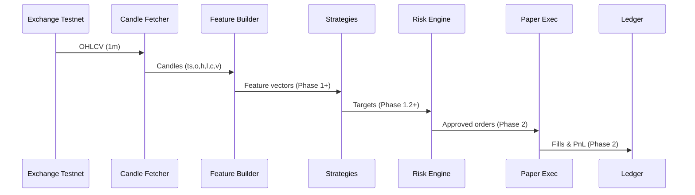

# Paperbot — AI Paper Trading Agent

**What this is**
An autonomous trading system that starts with **paper trading** (no real money) to build confidence, then can graduate to live trading. MVP runs on **Binance Spot Testnet**; the design supports multiple brokers via config.

**Key Goals**
- Robust end-to-end pipeline: **Market data → Features → Strategies → Risk → Execution (paper) → Ledger → Reports**
- Safety-first design: central Risk Engine + kill-switch control
- Observability: Prometheus metrics + Grafana dashboards + daily EOD reports
- Incremental development in **phases**, each with tests and documentation

## Tech Stack
- **Language:** Python 3.11
- **Core libs:** ccxt, pandas, numpy, pyarrow, ta/pandas-ta, pydantic
- **Monitoring:** prometheus_client, Prometheus, Grafana
- **Config/Env:** YAML configs + `.env` with **dynamic env-prefix** (e.g., `BINANCE_SPOT_TESTNET_*`)
- **Packaging/Runtime:** Docker + Docker Compose
- **Testing:** pytest, pytest-mock

## Repository Layout

```
src/paperbot/
├── data/         # exchange adapters, OHLCV/candles fetchers
├── features/     # feature pipeline (RSI/ATR/VWAP/Z-score/realized vol)
├── strategies/   # signal generation (MR, momentum, etc.)
├── risk/         # central risk engine + limits + kill-switch
├── exec/         # paper execution simulator (fees/slippage/partial fills)
├── metrics/      # Prometheus exporter
├── reports/      # EOD HTML/CSV
└── config/       # config loader & typed settings

config/           # YAML config + Prometheus/Grafana provisioning
tests/            # unit tests
```

## Current Status

- Phase 0 — Bootstrap & Candle Fetch Demo: PASS
  - Emits exactly 10 normalized candle lines; exits with "candle demo complete".
  - Prometheus endpoint served on `$PROMETHEUS_PORT` (default 8000).
- Phase 1.1 — Baseline Features: Implemented
  - RSI(14) [Wilder], ATR(14) [TR EWM], Session VWAP (UTC), Z-score to VWAP (50 bars), Realized Vol (30 bars).
  - Optional extras (config toggles): SMA/EMA crossover, Bollinger Bands, OBV, Keltner, skew/kurtosis, hour-of-day.

See also: `tests/test_feature_builder_phase11.py` for coverage of Phase 1.1 indicators.

## Setup & Run (Phase 0)

### 1. **.env** (Binance Spot Testnet)
```bash
BINANCE_SPOT_TESTNET_API_KEY=your_key
BINANCE_SPOT_TESTNET_API_SECRET=your_secret
PROMETHEUS_PORT=8000
```

### 2. **config/config.yaml** (snippet)
```yaml
exchange: binance
environment: spot-testnet
symbols: ["BTC/USDT", "ETH/USDT"]
timeframe: "1m"
fetch:
  rate_limit_ms: 900
  backoff_initial_ms: 500
  backoff_max_ms: 8000
```

### 3. Run via Docker
```bash
docker compose up --build

# metrics:
curl http://localhost:8000/metrics | head -n 10
# grafana: http://localhost:3000  (Prometheus DS pre-provisioned)
# prometheus: http://localhost:9090
```

### 4. Expected Phase 0 demo behavior
- Logs exactly 10 normalized candles total across symbols, then:
  ```
  INFO candle demo complete
  ```
- Compose may restart the container (demo ends by design).
- Metrics endpoint available on `:8000/metrics`.

## Local Development (venv)

```bash
# Python 3.11
python3.11 -m venv .venv
source .venv/bin/activate

# Install deps
pip install -U pip setuptools wheel
pip install ccxt pandas numpy pyarrow ta pandas-ta pydantic prometheus_client jinja2 matplotlib duckdb python-dotenv pyyaml pytest pytest-mock black ruff

# Export env and run
set -a; source .env; set +a
PYTHONPATH=src python -m paperbot.main

# Tests (show prints for a few results)
pytest -q
pytest -vv -s tests/test_feature_builder_phase11.py -k basic_bounds
```

## Features (Phase 1.1)

- rsi14: Wilder-smoothed RSI over 14 closes, clamped [0,100], safe default 50 on low data.
- atr14: True Range EWM with alpha=1/14, non-negative.
- vwap: Session VWAP for the current UTC day using close*volume.
- z_vwap: Z-score of (close - session VWAP) over 50-bar lookback; 0 if std≈0 or insufficient data.
- rv_30m: Realized volatility over last 30 bars: sqrt(sum(logret^2)), no annualization.

Windows can be tuned via `config/config.yaml` under `features`:

```yaml
features:
  window_rsi: 14
  window_atr: 14
  zscore_lookback: 50
  rv_window: 30
  expansion:
    sma_ema: true
    bollinger: true
    obv: true
```

## Observability (Metrics)

- Prometheus: starts in `paperbot.main` at `$PROMETHEUS_PORT` (default 8000).
- Counters:
  - `candles_fetched_total{symbol}`
  - `features_computed_total{symbol}`

Check quickly:
```bash
curl http://localhost:8000/metrics | head -n 10
```

If your browser says "connection refused": the demo exits quickly. Either:
- Re-run and open `/metrics` immediately, or
- Hold the server open: `HOLD_METRICS_SECONDS=120 PYTHONPATH=src python -m paperbot.main`

## Reports & Charts

- Generate candlestick PNGs and an HTML index:
  - Poetry: `make report`
  - venv: `PYTHONPATH=src python -m paperbot.reports.generate`
- Output location: `./reports/` (images in `./reports/images/`, HTML at `./reports/index.html`)
- Session VWAP is overlaid on charts; bars default to last 120 candles (tune via `REPORT_BARS`).

---

## Architecture (End-State Target)

```mermaid
flowchart LR
  subgraph Ingest
    A[Exchange APIs<br/>(Binance, Alpaca, ...)] --> B[Data Fetchers<br/>(ccxt/SDKs)]
    B --> C[Raw OHLCV Queue]
  end

  subgraph Features
    C --> D[Feature Builder<br/>RSI/ATR/VWAP/ZScore/RealizedVol]
    D --> E[Feature Stream]
  end

  subgraph Strategy
    E --> F[Strategies<br/>Mean Reversion / Momentum / Pairs]
    F --> G[Targets<br/>(side, size, stops, tp)]
  end

  subgraph Risk & Execution
    G --> H[Risk Engine<br/>exposure caps, daily loss, kill-switch]
    H -->|approved| I[Paper Execution<br/>fees/slippage/partial fills]
    I --> J[Ledger<br/>Parquet/SQLite]
  end

  subgraph Observability
    I --> K[Prometheus Metrics]
    J --> L[EOD Reports<br/>HTML/CSV]
  end
```

## Runtime Dataflow (current: Phase 0→1 baseline)



---

## Phase Map
- **Phase 0** — Bootstrap & Candle Fetch Demo ✅ (complete)
- **Phase 1** — Features & Strategies (MVP)
  - 1.1: Feature Builder (RSI, ATR, VWAP, Z-score to VWAP, realized vol) ✅
  - 1.1.1: Optional features (MACD, Bollinger, OBV, etc.)
  - 1.2: Strategy base + MR/MO
- **Phase 2** — Risk & Execution (paper realism)
- **Phase 3** — Orchestration, Metrics, EOD Reports
- **Phase 4** — Backtesting/Validation
- **Phase 5** — Allocation & Daily Risk Discipline
- **Phase 6** — Paper Burn-in & Go/No-Go
- **Phase 7** — Extensions (pairs, basis, execution improvements)

---

## Phase Log (living diary)

New phase entries will be inserted between these anchors automatically by future tasks.

<!-- PHASE-LOG-START -->

### Phase 0 — Bootstrap & Candle Fetch Demo ✅

**Achievements**
- Repo scaffolding with Docker/Compose, Prometheus, Grafana
- Dynamic env-prefix loader (e.g., `BINANCE_SPOT_TESTNET_*`)
- Binance Spot Testnet integration via ccxt
- Demo: 10 normalized candles per symbol; clean exit with "candle demo complete"
- Metrics endpoint on `:8000/metrics`

**Hurdles & Fixes**
- Python 3.11 mismatch locally → standardized on Docker
- Validated environment resolution logs and curl check for `/metrics`

**Evidence**
- Logs: `Resolved env prefix: BINANCE_SPOT_TESTNET`, `Exchange: binance, Environment: spot-testnet`
- Logs: candle lines + `candle demo complete`
- `curl http://localhost:8000/metrics | head`

<!-- PHASE-LOG-END -->

---

## Contributing / Extending
- Add brokers by env-prefix convention (e.g., `BINANCE_SPOT_API_KEY`, `ALPACA_PAPER_API_KEY`).
- Add/change baseline indicators in `src/paperbot/features/feature_builder.py`:
  - Key functions: `_rsi_wilder`, `_atr_ewm`, `_session_vwap_current`, `_zscore_to_vwap`, `_realized_vol`, `compute_phase11_features`.
- Add optional indicators in `src/paperbot/features/expansion.py` and toggle in `config/config.yaml` under `features.expansion`.
- Run tests: `pytest -q` (use `-s` to see printed values in Phase 1.1 tests).

For SRE runbook (tests, operations, troubleshooting), see `docs/SRE.md`.

## Disclaimer
Educational/research use only. Not financial advice.
